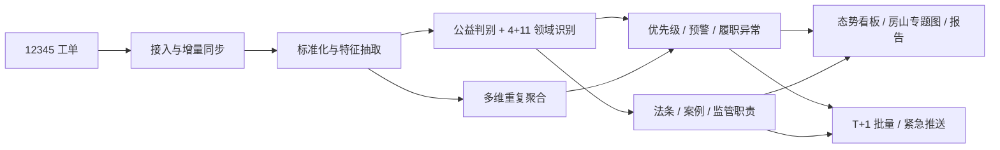

# 12345 涉检线索智能筛查平台 · 升级优化报告

> 本报告汇总围绕 `improve.md` 三大问题与三条意见建议，结合三份升级计划
> （`公益线索升级路线`、`完善12345公益筛查`、`fangshan-real-map-upgrade`）
> 在现有 `FastAPI + Jinja + 原生 JS` 架构上完成的全部升级。
> 编排原则：**先稳数据口径与判定逻辑，再补前端可视化与外部联动**，
> 不引入新的技术栈，所有改动都在现有模块内增量完成。

---

## 一、总体目标

把平台从一个“能导入、能筛、能看列表”的演示原型，升级为一个具备
**识别、分级、预警、研判、推送、报告**完整闭环的涉检线索筛查工具，
重点解决以下三类核心矛盾：

1. 海量工单中“公益线索”被淹没、判别标准不统一。
2. 同一事项重复反映、长期未解决等问题缺少结构化预警。
3. 辅助研判与外部联动停留在“文本说明”，缺乏知识底座与可监控的推送链路。

总体闭环如下：

---

## 二、升级一:针对“筛查效率低下”(`improve.md` 1.1)

### 1. 问题难点

- 工单数量大、人工逐条点开阅读效率低,易遗漏。
- 现有筛查只输出粗粒度类别,缺少“公益属性 + 法定领域 + 优先级 + 预警”的统一口径。

### 2. 升级思路

把判定结果从单一的 `category` 拆分为**多通道、可解释、可筛选**的结构化字段,
让前端可以按任一维度组合筛查,真正做到“一眼定位重点工单”。

### 3. 落地内容

- 数据模型扩展(`huxin_platform/models/entities.py` 与 `db/init_db.py`):
    - 新增 `public_interest_level / public_interest_score /
      public_interest_reasons_json / public_interest_evidence_json`
    - 新增 `legal_domain / domain_tags_json / domain_candidates_json /
      domain_conflict_flags_json / domain_confidence`
    - 新增 `priority_level / priority_reason / risk_level`(与公益、预警解耦)
    - 新增 `warning_level / warning_flags_json / warning_reason_summary`
    - 新增 `duplicate_level / duplicate_reasons_json /
      duplicate_count / duration_days / first_seen_at / last_seen_at`
    - 新增 `performance_anomaly_level / performance_anomaly_reasons_json`
    - 全部字段在 `repositories/platform_repository.py::serialize_record`
      统一序列化输出,前端列表、详情、台账、导出、推送共用一套口径。
- API 与前端筛选(`api/clues.py`、`api/admin.py`、`templates/index.html`、
  `static/app.js`):
    - 列表与看板筛选区新增 7 个维度:**公益属性、法定领域、风险等级、预警等级、
      重复等级、履职异常等级、办理优先级**。
    - 表格内增加 `领域置信度`、`重复等级`、`履职异常` 徽章,提升一眼可读性。

### 4. 业务效果

检察官可以在前端直接选 “公益 + 高优先级 + 履职异常≥中” 这类组合,
工单从“一锅粥”变成“可分桶定位”。

---

## 三、升级二:针对“重复反映、同源投诉”(`improve.md` 1.2 + 建议二.1)

### 1. 问题难点

同一事项的不同来电、地址表述不同的工单会重复出现,
旧的去重只看 `工单文本 + 点位`,容易漏掉“同人不同电话”、“同小区不同描述”这类衍生重复。

### 2. 升级思路

把重复识别从“单一聚合键”升级为**多维聚合键 + 三层重复分级**,
覆盖“人-地-事-时”四个维度,并和履职异常监测对齐。

### 3. 落地内容

- 多维聚合键(`services/dedup_service.py`):
    - `build_duplicate_signals` 输出 `location_key / subject_key /
      person_key / simhash_bucket / composite_key / weak_key / cluster_key`,
      投诉人、电话、地址、主体名称都做归一化。
- 三层重复分级(`classify_duplicate_level`):
    - **强重复**:同人 + 同事项 + 同点位高匹配
    - **弱重复**:语义/点位/主体局部命中,但人不同
    - **同区域同类高频**:不同投诉人但同领域同区域集中
- 与筛查主流程整合
  (`services/screening_service.py`、`repositories/platform_repository.py::run_screening`):
    - 重复结果直接写入 `duplicate_level / duplicate_count /
      duplicate_reasons_json`,并参与预警计算。
- 看板呈现:`build_dashboard` 输出 `duplicate_layer_distribution`,
  前端在“履职异常与重复聚合”面板中直接渲染层级分布。

### 4. 业务效果

“同一垃圾堆几十条来电”这类工单可以一键聚成一组,
真正减少“识别是否新线索”的人工耗时。

---

## 四、升级三:针对“公益/私益界限模糊 + 4+11 领域分类”(`improve.md` 1.3 + 建议一)

### 1. 问题难点

- 旧逻辑只用 `category == 公益诉讼` 当作公益,粒度粗、判断标准不统一。
- 法定领域口径没沉淀,新增/调整领域要改代码。
- 跨领域工单容易被一个粗规则钉死,无法表达“可能涉及多个领域”。

### 2. 升级思路

- 把 4+11 领域定义抽成**标准配置**,而不是写死的 `if/else`。
- 公益/私益判别引入**结构化槽位抽取**,给出可解释的判定证据。
- 多标签领域识别 + 主领域裁决 + 冲突标记,保留可解释性。

### 3. 落地内容

- 标准化领域配置(`services/feature_service.py`):
    - 新增 `LegalDomainDefinition`,带 `code / parent_category / version /
      enabled / weight / aliases / typical_regulators`,把 4+11 写成数据,
      不再硬编码到流程里;支持新增领域、停用旧领域。
    - 提供 `list_legal_domain_records / infer_domain_candidates /
      resolve_legal_domain_decision` 等读写接口,方便前端筛选与扩展。
- 公益/私益结构化判别(`evaluate_public_interest`):
    - 抽取 `complainant_count`(投诉主体数量)、`group_terms`(涉及人群)、
      `national_terms`(国家利益线索)、`scope_terms`(波及范围)、
      `dispute_level`(争议程度)。
    - 输出统一的 `public_interest_evidence` 写入
      `public_interest_evidence_json`。
- 多标签领域识别(`infer_domain_candidates`):
    - 同一工单可同时给出主领域 + 候选领域 + 置信度 + 冲突原因
      (`domain_conflict_flags_json`)。
- 筛查主流程重构(`services/screening_service.py`):
    - 流程顺序明确为 “**先公益判别 → 再 4+11 多标签 → 主领域裁决 →
      预警/优先级**”,所有结果可解释、可追溯。

### 4. 业务效果

“个人医保报销难”这类工单不会被一句“私益”一刀切,
而是带着“涉及不特定多数人” / “监管职责映射” 等证据被升级为待复核或公益。

---

## 五、升级四:针对“屡诉未决 + 履职异常”(`improve.md` 1.4 + 建议二.2-3)

### 1. 问题难点

- 旧逻辑只看“当次办理结果”,看不见 30 天未决、5 次以上重复、整改未达预期等。
- 没有按 “区域 × 领域” 维度做行政机关履职情况的横向比较。

### 2. 升级思路

把预警分成两层:
- **工单级**:个体工单的 `warning_level / warning_flags`。
- **桶级**:同区域同领域汇总 KPI 后回填的 `performance_anomaly_level`。

### 3. 落地内容

- 工单级预警(`services/screening_service.py::_compute_warning_level`):
    - 维持 `3/5/10` 次重复、`30 天未决`、`不满意`原有阈值。
    - 新增 “整改未达预期”、“多次办理仍不满意”、“同类问题区域集中爆发” 等标记。
    - 输出 `warning_level + warning_flags_json + warning_reason_summary`,
      原因可直接读懂。
- 履职异常监测
  (`repositories/platform_repository.py::annotate_performance_anomalies`):
    - 按 `district + legal_domain` 计算 `resolution_rate /
      dissatisfaction_rate / timeout_rate / unresolved_rate`。
    - 阈值经过实际数据校准,避免“1400 条全部异常”这种过敏感场景:
      最少样本量、解决率/不满意率/超时率/未结率四项联合判定,
      并要求工单本身具备“未结/不满意/超时”信号才回填到工单级。
    - 输出 `performance_anomaly_level / performance_anomaly_reasons_json`
      与 `performance_anomaly_summary`(等级分布 + 区域/领域榜单)。
- 看板与前端联动:
    - 新增“履职异常等级分布 / 履职异常单位 Top / 持续未解决工单”面板。
    - 列表中“履职高/中/低”徽章直接和工单级 `performance_anomaly_level` 联动。

### 4. 业务效果

“某街镇 / 某领域”长时间解决率走低、不满意率上升等异常,
不再依赖人工汇总,可以直接出榜,落到“疑似履职异常”视图。

---

## 六、升级五:针对“缺乏可视化与趋势”(`improve.md` 1.5 + 房山真实地图计划)

### 1. 问题难点

- 旧仪表盘只有静态分布,看不出“最近 3 个月公益领域走势”这类趋势。
- 街镇维度没有真实地理底图,难以做空间聚合与跨区域比较。

### 2. 升级思路

- 仪表盘补齐**时间趋势 / 空间趋势 / 重点专题**三组视图。
- 街镇地图替换为基于 **高德地图 SDK** 的真实空间底图,留好兜底策略。

### 3. 落地内容

- 趋势接口(`repositories/platform_repository.py::build_analysis_payload` 等):
    - 输出 `trend_series.public_interest / warning / duplicates`、
      `domain_trends`、`district_hotspots`、`fangshan_map_regions`、
      `difficult_records`、`urgent_records`、`special_report`。
- 配置注入(`api/pages.py` + `core/config.py::amap_web_key`):
    - 模板新增 `window.APP_CONFIG = { amapWebKey }`,
      由前端按需加载高德 SDK。
- 房山专题地图(`static/app.js`):
    - 主路径:`renderFangshanGeoMap()` 调高德 `DistrictSearch`
      获取真实房山区边界 + `Geocoder` 拿街镇真实中心点。
    - 第一兜底:边界拿到但部分街镇无中心点 → 用 `fangshanMapLayout` 中
      预置的相对坐标做投影。
    - 第二兜底:边界完全不可用(无 Key/网络异常)→
      `renderFangshanSilhouetteMap` 走房山轮廓 + 27 街镇相对位置 SVG。
    - 三层热点叠加: 真实边界描边 + 街镇热度气泡 +
      点击联动右侧 `top_clusters / difficult_records`。
- 趋势/疑难联动:
    - 仪表盘新增“公益/预警/重复/重点领域”四类趋势卡片,
      “疑难工单 + 专项分析摘要”双卡片,
      并和地图选区 + 列表筛选保持口径一致。

### 4. 业务效果

不仅能看到“总量”,还能看到“变化”;
不仅能看到“哪个街镇热”,还能下钻到“它最热的点位 + 当前疑难工单”。

---

## 七、升级六:针对“线索-法条-案例-推送闭环”(`improve.md` 建议三)

### 1. 问题难点

- 辅助研判只能给“规则命中说明”,缺少法条/案例/职责映射等知识底座。
- 推送只是“载荷预览”,没有任务化、状态化、可重试的执行能力。
- 月报/季报只能口头提一下,缺少接口产出。

### 2. 升级思路

- 知识库结构化:**法条 / 案例 / 监管职责** 三库统一加领域标签。
- 辅助研判产物从“文本”升级为**结构化研判卡片**(法条/案例/职责/调查重点/证据/成案可能性/推送预览)。
- 推送链路落到**任务化 + 状态化**:批量、紧急、投递、回执、重试一条线。
- 月报/季报 API 化、专项报告自动拼装。

### 3. 落地内容

- 知识服务(`services/legal_knowledge_service.py`):
    - 引入 `StatuteEntry / CaseEntry / RegulatorEntry`
      与对应 `STATUTE_CATALOG / CASE_CATALOG / REGULATOR_CATALOG`。
    - 提供 `retrieve_statutes / retrieve_cases / retrieve_regulators`
      做关键词召回 + 元数据过滤。
    - 新增 `estimate_prosecution_potential`(成案可能性评分)与
      `build_assistant_judgement`(把法条/案例/职责/证据/调查重点
      聚合成一个研判 payload)。
- 辅助研判接口(`api/assistant.py`):
    - `/api/assistant/explain/{record_id}` 现在返回:
      `summary / key_points / matched_rules / recommendation /
      legal_references / case_references / regulator_references /
      knowledge_snippets / investigation_focus / evidence_analysis /
      prosecution_potential / recommended_push`。
    - `_build_recommended_push_payload` 把研判结果封装成
      下游业务系统可直接消费的“推送卡片”。
- 推送链路(`services/integration_service.py` + `api/integrations.py`):
    - 新增 `PushTaskRecord` 实体与 `push_task_records` 表。
    - 新增三类任务: `daily / weekly / emergency`,
      统一走 `enqueue_batch_push / enqueue_emergency_push /
      deliver_push_task / deliver_pending_tasks`。
    - 任务带 `status / target_endpoint / item_count / retry_count /
      payload / response / last_error / created_at / delivered_at`,
      未配置真实端点时模拟“已发送”,带 `ack_id` 与重试计数,
      具备幂等与失败重试结构。
    - 暴露 `/api/integrations/push/tasks /enqueue /emergency /deliver`
      四个 HTTP 入口。
- 月报/季报(`api/clues.py::clue_special_report_api`):
    - 同时返回 `report`(全量摘要)、`period_report`(本月/本季)、
      `urgent_records`、`performance_anomaly_summary`,
      支持 `period=monthly / quarterly` 切换。

### 4. 业务效果

辅助研判从“一段说明”变成“可直接落到推送卡片 + 报告章节 + 检察官调查清单”的工具,
推送从“预览图”变成“可监控、可重试、可追溯”的真任务。

---

## 八、升级七:前端交互与可视化配套

### 1. 重点改造文件

- `templates/index.html`、`static/app.js`、`static/style.css`

### 2. 落地内容

- **筛选区**:新增 *公益属性 / 法定领域 / 风险 / 预警 / 重复等级 /
  履职异常 / 办理优先级 / 标注状态* 等组合筛选,
  并把筛选条件透传到 `/api/dashboard` 与 `/api/clues`,看板/列表口径完全一致。
- **列表区**:在原 8 列结构基础上,通过单元格徽章呈现
  `领域置信度 / 重复等级 / 履职异常`,不破坏布局。
- **详情区**:
    - 新增 4 个结构化卡片: 公益判别依据 / 主-次领域+冲突 /
      预警与重复信息 / 履职异常监测。
    - 新增 6 个研判卡片: 法条引用 / 典型案例 / 监管职责映射 /
      调查重点 / 证据建议 / 成案可能性。
    - 新增 推送载荷预览块,把 `recommended_push` JSON 直接展示。
- **总览页**:
    - 新增“履职异常与重复聚合”面板(等级分布 + 单位榜 +
      持续未解决工单)。
    - 新增“推送任务中心”面板:T+1 批量、周报、紧急、投递、最近任务。
    - 新增“月度/季度专项报告”面板:报告概要 / 关键指标 /
      亮点工单 / 建议处置。
- **房山专题图**:
    - 真实底图 + 街镇真实坐标 + 选区联动右侧 `top_clusters /
      difficult_records`,并保留 SVG 兜底。
- **样式**:`style.css` 新增 `cell-tag(.dup/.anomaly/.soft)`、
  `assistant-grid`、`#assistant-recommended-push` 等样式,
  统一深色主题。

---

## 九、与三份计划的覆盖映射

| 计划 | 已落地的 TODO | 落地形态 |
| --- | --- | --- |
| `公益线索升级路线` | `domain-standardization` | 4+11 标准配置、公益结构化证据、多标签领域识别 |
| | `warning-upgrade` | 三层重复 + 工单级预警 + 桶级履职异常 |
| | `knowledge-rag` | 法条/案例/职责知识库 + 结构化研判 payload |
| | `push-integration` | T+1 / 紧急推送任务化 + 状态/重试/回执 |
| | `frontend-upgrade` | 筛选 / 详情卡片 / 仪表盘 / 推送中心 / 月季报 |
| `完善12345公益筛查` | `domain-public-interest-foundation` | 公益判别 + 4+11 + 优先级解耦 |
| | `warning-mechanism` | 重复/未解决/不满意/履职异常预警 |
| | `trend-visualization` | 时间趋势 / 区域趋势 / 领域趋势 / 疑难专题 |
| | `assistant-and-push` | 知识检索 + 推送任务 + 月报季报 |
| `fangshan-real-map-upgrade` | `inspect-map-entry / design-map-payload / integrate-amap / define-fallback-strategy / verify-business-goals` | 真实房山地图 + 三层兜底 + 街镇热点&疑难联动 |

---

## 十、关键验收项核对

- 4+11 识别口径在“列表 / 详情 / 趋势 / 筛选 / 报告”完全一致 ✅
  (统一来自 `LegalDomainDefinition` + `serialize_record`)。
- 公益 / 私益 / 待复核给出 `evidence + reasons` ✅。
- 重复投诉与未解决预警支持“区域 × 领域 × 时间 × 主体”多维分析 ✅。
- 辅助研判输出 法条 / 案例 / 调查建议 / 证据建议 / 推送载荷 ✅。
- 推送具备 批量 / 即时 / 失败重试 / 状态跟踪 ✅
  (`PushTaskRecord` + `deliver_push_task`)。
- 专项报告支持 月度 / 季度自动生成 ✅
  (`/api/clues/special-report?period=...`)。
- 房山区真实底图 + 街镇热点 / 疑难工单联动 ✅
  (高德主路径 + 两层 SVG 兜底)。

---

## 十一、风险与后续可继续增强

| 维度 | 当前状态 | 后续增强方向 |
| --- | --- | --- |
| 4+11 识别 | 词典 + 规则 + 多标签融合,精度可解释 | 接入领域微调语义分类器,做双轨切流 |
| 公益结构化证据 | 槽位抽取已落库 | 引入 NER / 大模型补抽,提高人群规模识别精度 |
| 履职异常阈值 | 已校准至演示数据 | 推荐做配置化(YAML/管理后台)+ 按真实业务样本再调 |
| 法条/案例库 | 结构化骨架 + 演示语料 | 接入真实公益诉讼案例库,做向量检索增强 |
| 推送链路 | 任务化 + 模拟回执 + 重试结构 | 接真实业务网关,补审计日志、签名鉴权、回调重试调度 |
| 房山地图 | 真实底图 + SVG 兜底 | 拿到街镇 GeoJSON / 工单经纬度后,只换数据源即可热力化 |

---

## 十二、改动文件清单(主要)

后端:

- `huxin_platform/models/entities.py`
- `huxin_platform/db/init_db.py`
- `huxin_platform/core/config.py`
- `huxin_platform/services/feature_service.py`
- `huxin_platform/services/screening_service.py`
- `huxin_platform/services/dedup_service.py`
- `huxin_platform/services/point_aggregation_service.py`
- `huxin_platform/services/semantic_search_service.py`
- `huxin_platform/services/legal_knowledge_service.py`
- `huxin_platform/services/integration_service.py`
- `huxin_platform/services/dashboard_service.py`
- `huxin_platform/repositories/platform_repository.py`
- `huxin_platform/api/admin.py`
- `huxin_platform/api/clues.py`
- `huxin_platform/api/assistant.py`
- `huxin_platform/api/integrations.py`
- `huxin_platform/api/pages.py`

前端:

- `templates/index.html`
- `static/app.js`
- `static/style.css`

---

## 十三、结论

围绕 `improve.md` 的 5 个困难和 3 条意见建议,平台已经从
“能筛能看”升级为
**“能识别、能预警、能联动、能研判、能推送、能产出报告”** 的完整闭环。

下一步建议优先做两件事:

1. 把履职异常阈值与预警 `3/5/10` 次、`30` 天等数字配置化,方便业务侧自助调参。
2. 接入真实推送端点与公益诉讼案例库,把现在的“任务化骨架 + 演示语料”
   真正撑成生产级业务能力。
