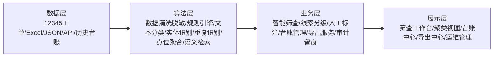

# 12345市民投诉热线数据中涉检线索智能筛查平台

## 二、完整工具原型设计方案（对应：技术可行性30%）

### 2.1 整体架构图（数据层 → 算法层 → 业务层 → 展示层）

本项目围绕“从12345热线海量投诉数据中自动发现涉检线索”这一目标，构建“数据层、算法层、业务层、展示层”四层一体化架构。总体设计思路是：以离线可部署为前提，以规则引擎保障可解释性，以轻量模型和语义能力提升识别准确率，以人工复核机制保证结果最终可用。

四层职责如下：

1. **数据层**：统一接收12345工单、Excel表格、JSON数据、外部接口数据及辅助业务数据，完成标准化存储。
2. **算法层**：负责清洗、脱敏、规则匹配、文本分类、实体抽取、重复投诉识别、监督点位聚合和语义补充召回。
3. **业务层**：将算法结果转化为检察业务可使用的线索台账，支撑筛查、复核、标注、导出全流程闭环。
4. **展示层**：以工作台形式展示筛查结果、风险分布、重点点位、复核状态和导出记录，便于演示和实际使用。

该架构的核心特点，不是单纯做“数据过滤”，而是把算法能力嵌入检察业务流程，形成一套可落地、可复核、可审计的涉检线索发现平台。

### 2.2 数据模块设计

#### 2.2.1 12345原始数据结构解析

12345热线数据通常来源复杂、字段命名不统一，常见形式包括 Excel 导出表、CSV 文件、JSON 报文以及接口返回数据。结合实际业务，平台将原始字段归纳为以下五类：

1. **基础标识字段**：工单编号、来源渠道、工单类型、创建时间、办结时间。
2. **投诉主体字段**：来电人姓名、联系方式、身份标签。
3. **文本内容字段**：标题、主要内容、问题描述、问题分类、标签、办理结果、回复内容。
4. **空间位置字段**：所属区县、街乡镇、村/社区、点位、小区、地址、企业名称。
5. **业务辅助字段**：成案领域、事项性质、是否解决、满意度、部门处理意见。

平台通过字段映射机制，将不同来源中的异名字段统一到标准结构。例如：

- `工单编号 / 单号 / ticket_id` 统一映射为 `ticket_no`
- `主要内容 / 诉求内容 / 问题描述` 映射为 `complaint_text`
- `被反映区 / 所属区县 / 区县` 映射为 `district`
- `地址 / 地点 / 小区点位 / 企业名称` 汇总为 `location_text`

标准化后的核心数据对象包括：

- 工单编号
- 数据来源
- 投诉标题
- 投诉全文
- 投诉人脱敏信息
- 行政区划
- 点位信息
- 原始载荷
- 筛查结果
- 人工标注结果
- 导出与审计信息

这种设计既保留原始证据链，又能满足后续算法处理和业务查询需要。

#### 2.2.2 数据清洗与脱敏规范

12345热线数据包含明显的个人信息和政务敏感信息，因此平台必须遵循“最小必要、分类处理、全程可追溯”的原则。平台在导入后执行如下预处理策略：

1. **格式标准化**：统一时间格式、文本编码、空值表示、字段长度和异常字符。
2. **内容去噪**：剔除无工单编号、无实质内容、重复标题或明显无效记录的数据。
3. **文本重组**：将标题、分类、主要内容、办理结果、回复内容拼装为统一投诉文本，提高筛查稳定性。
4. **静态脱敏**：对姓名、手机号、证件号、详细住址等敏感信息做静态脱敏。
5. **原始数据隔离**：原始数据与标准化结果双轨保存，原始字段仅授权人员可见。
6. **展示最小化**：默认界面和导出结果只展示必要业务字段，不展示完整个人身份信息。

建议脱敏规则如下：

- 姓名：`张某`、`李某某`
- 手机号：`138****0001`
- 身份证号：仅保留前6位与后4位
- 详细地址：仅保留到街道/社区级别

这一设计保证平台能够在“可用”的前提下做到“不可滥见”，满足政务敏感数据使用要求。

### 2.3 技术组件选型（NLP模型、规则引擎、向量数据库等）

本平台坚持“技术成熟、易于离线部署、便于解释和维护”的原则，核心组件选型如下：

| 组件类别 | 选型方案 | 说明 |
|------|------|------|
| Web框架 | FastAPI | 轻量、稳定、接口开发效率高，适合原型和内网应用 |
| 前端展示 | HTML + JavaScript + Jinja2 | 架构简单，适合内网环境快速演示和部署 |
| 数据库存储 | SQLite（原型）/ PostgreSQL（正式） | 原型阶段部署快，正式环境支持更强查询、索引和审计 |
| 表格处理 | pandas + openpyxl | 适合处理12345 Excel批量导入 |
| 规则引擎 | Python规则库 + 业务关键词词典 | 可解释、可维护、便于检察业务人员共建 |
| 文本分类模型 | TF-IDF + Logistic Regression / Linear SVM | 适合中文短文本、小样本、离线训练和快速推理 |
| 中文语义模型 | BGE-small-zh / BGE-base-zh | 适合中文语义召回和相似投诉发现 |
| 实体抽取 | 规则抽取 + 正则模板 + 可扩展NER | 优先实现欠薪、点位、金额、人数、单位等重点要素抽取 |
| 向量检索 | FAISS / pgvector | 满足离线环境和后续百万级语义检索扩展 |
| 重复识别 | SimHash / 文本指纹 | 用于重复投诉和相似投诉聚类 |
| 导出服务 | pandas + docxtpl + PDF渲染组件 | 支持 Excel、Word、PDF 多格式导出 |
| 审计日志 | 数据库审计表 + 文件日志 | 满足操作留痕和责任追踪要求 |

技术亮点在于：

1. **规则+模型+语义三者融合**，兼顾解释性与准确率。
2. **支持点位识别和重复聚类**，能够发现普通筛选工具难以识别的“群体性、重复性、空间集中性”线索。
3. **支持离线部署**，适合检察工作网环境。
4. **组件可渐进升级**，原型和正式环境之间可平滑演进。

### 2.4 数据流转逻辑（从接收→筛查→分级→入库→导出的完整流程）

平台的数据流转遵循“接收标准化、算法初筛、人工复核、结果入账、按需导出”的闭环流程。

完整流程如下：

1. **数据接收**
   - 接收 Excel、JSON 文件；
   - 对接12345接口、街镇综治系统接口、检察内部业务接口；
   - 支持人工补录和历史数据回灌。

2. **标准化预处理**
   - 完成字段映射；
   - 拼装标准投诉文本；
   - 执行清洗、去噪、脱敏；
   - 保存原始载荷与标准化载荷。

3. **智能筛查**
   - 规则引擎识别强业务线索；
   - 文本分类模型进行类别预测；
   - 实体抽取模块提取项目、地点、金额、人数、单位、时间；
   - 重复识别模块发现同类投诉；
   - 点位聚合模块识别“同一点位多次投诉”；
   - 语义检索模块补充召回相似表达的投诉。

4. **线索分级**
   - 判断是否涉检；
   - 识别所属类型：刑事犯罪、公益诉讼、民事支持起诉、行政执法监督；
   - 评估高、中、低三级风险；
   - 生成筛查摘要和置信度说明。

5. **结果入库**
   - 将筛查结论、结构化字段、规则命中、模型结果、聚类结果写入台账库；
   - 记录筛查时间、模型版本、任务批次和导出状态。

6. **人工复核与标注**
   - 对候选线索进行确认、驳回或补充证据；
   - 更新办理状态、复核意见和人工标签；
   - 复核结果反哺规则和模型优化。

7. **台账检索与导出**
   - 按时间、区域、类型、风险、点位、状态等条件检索；
   - 一键导出 Word、PDF、Excel 等台账材料；
   - 记录导出行为和导出范围。

这一流程的优势在于，平台不是只做“一次性筛查”，而是形成“筛查-复核-沉淀-再优化”的持续业务闭环。

### 2.5 检察工作网部署方案（离线、合规、可审计）

考虑检察机关对数据安全、网络隔离和行为留痕的要求，平台采用“单机原型版 + 内网部署版”双层部署策略。

#### 1. 单机离线原型版

- 部署环境：检察内网终端或演示服务器
- 运行方式：Python + FastAPI + 本地数据库
- 模型方式：本地规则引擎 + 本地分类模型 + 本地语义模型
- 适用场景：方案演示、试点验证、小规模实战测试

#### 2. 检察工作网正式部署版

- 部署位置：检察专网应用服务器、数据库服务器
- 数据库：PostgreSQL 或国产数据库
- 向量能力：本地向量索引服务或 `pgvector`
- 文件服务：内网共享存储或对象存储
- 数据接入：通过专线、安全交换区或内网接口接入12345数据
- 权限机制：统一认证、角色分权、操作审批、日志审计

#### 3. 合规与审计机制

- 导入、筛查、标注、导出、配置更新均记录操作日志；
- 原始数据、脱敏数据、展示数据分层管理；
- 支持按批次追溯规则版本、模型版本和导出记录；
- 支持脱网运行，不依赖公网模型服务；
- 支持敏感操作审批和审计查询。

该方案符合检察工作网“离线可运行、数据可控、过程可审计、结果可追溯”的基本要求。

---

## 三、核心功能实现说明（对应：功能完整性30%）

本节围绕赛题要求的核心能力，说明平台如何完成“数据导入、智能筛查、线索标注、台账管理、一键导出”全流程。

### 3.1 数据导入（支持Excel/JSON/API，断点续传）

平台支持三种主要导入方式：

1. **Excel导入**：适用于12345批量导出的工单表，支持多 sheet 解析、字段自动映射和批量入库。
2. **JSON导入**：适用于标准化接口回执或历史归档文件，便于批量回灌。
3. **API导入**：支持对接12345、街道综治、检察业务等系统接口，实现拉取式导入。

为保证大批量导入稳定可靠，平台设计了“任务化导入 + 分批处理 + 状态续传”机制：

- 每次导入生成唯一任务编号；
- 记录总数据量、已处理数据量、失败数据量和任务状态；
- 按分页或分块方式执行，避免一次性读入过大；
- 当导入中断时，可从上一次成功批次继续，避免重复处理。

这一点区别于普通表格上传工具。普通工具往往只是“把文件导进来”，本平台则在导入阶段就完成标准化、清洗和证据链保留，为后续智能识别服务。

### 3.2 智能筛查

平台的智能筛查采用“文本分类 + 实体识别 + 规则匹配”三位一体模式。

#### 1. 文本分类

对投诉文本进行短文本分类，判断其更接近以下哪类检察业务线索：

- 刑事犯罪
- 公益诉讼
- 民事支持起诉
- 行政执法监督
- 其他非涉检事项

#### 2. 实体识别

从投诉文本中自动提取：

- 工程项目名称
- 涉事地点
- 开工时间或案发时间
- 工人人数或涉及人数
- 欠薪主体或涉事单位
- 欠薪金额或涉案金额
- 是否签订劳动合同等业务关键要素

这一步特别适用于“拖欠工资”等赛题强调的重点场景。

#### 3. 规则匹配

平台预置检察业务规则词典，对强业务线索进行快速命中，例如：

- 欠薪维权类：拖欠工资、讨薪、工资未发、未签劳动合同
- 弱势群体保护类：家暴、虐待、残疾人、未成年人
- 行政监督类：小过重罚、同案不同罚、程序违法、重复处罚
- 公益诉讼类：污水、垃圾堆放、油烟扰民、消防通道堵塞
- 刑事犯罪类：诈骗、非法集资、非法拘禁、故意伤害

三类能力结合后，系统输出类别、子类、风险等级、置信度、结构化字段和可解释说明。

### 3.3 线索标注

智能筛查只是第一步，平台强调“人工确认”环节。标注模块主要支持：

- **人工确认**：确认系统筛出的有效涉检线索；
- **人工驳回**：排除普通民生诉求或误判线索；
- **补充证据**：补录金额、人数、点位、附件说明等内容；
- **办理跟踪**：标记为待复核、已研判、建议移送、暂不立案等状态。

人工标注结果一方面进入最终业务台账，另一方面反向成为后续模型训练样本和规则优化依据，形成持续迭代的学习机制。

### 3.4 线索分级机制

平台从“业务类型”和“风险等级”两个维度对线索进行自动分级。

#### 1. 涉检业务类型

- 刑事犯罪
- 公益诉讼
- 民事支持起诉
- 行政执法监督

#### 2. 高/中/低三级预警

- **高风险**：如诈骗、故意伤害、大额欠薪、多次重复投诉且指向同一点位的公益问题、典型小过重罚案件等。
- **中风险**：具备较明显涉检特征，但证据仍需补充核验。
- **低风险**：信息不完整、点位不明确、仅弱相关命中或更接近普通民生类投诉。

分级依据包括：

- 规则命中数量和强度
- 模型置信度
- 语义相似度
- 是否存在明确点位
- 是否为重复投诉
- 涉及金额、人数、投诉频次等结构化因素

这一分级机制可以直接为检察官提供“优先办理顺序”，而不是让所有线索平铺展示。

### 3.5 台账管理（按时间、区域、类型检索）

平台建立统一的涉检线索台账，支持以下维度检索：

- 按时间检索
- 按区域检索
- 按类别检索
- 按风险等级检索
- 按是否重复投诉检索
- 按是否存在点位检索
- 按复核状态和办理状态检索

台账中的每条记录，至少包含：

- 工单编号和来源
- 投诉摘要
- 涉检类别
- 风险等级
- 点位信息
- 结构化抽取结果
- 人工标注结论
- 办理状态
- 导出记录

相比普通数据检索系统，本平台的台账是“已加工、可研判、可办理、可导出”的业务台账，不只是原始投诉数据列表。

### 3.6 一键导出（支持Word/PDF/Excel，含脱敏）

平台支持多格式导出能力：

1. **Excel导出**：用于批量台账、数据统计和复核清单。
2. **Word导出**：用于线索研判报告、移送建议稿、汇报材料。
3. **PDF导出**：用于正式归档、展示和对外流转。

导出时执行以下安全规则：

- 自动对姓名、电话等字段脱敏；
- 仅导出业务必要字段，避免原始敏感内容直接外流；
- 支持按类别、风险等级、办理状态筛选导出；
- 记录导出人、导出时间、导出范围和文件名。

这一设计使平台不仅能“发现线索”，还能直接支撑检察业务汇报和材料沉淀。

---

## 四、算法说明与准确率验证（对应：系统稳定性20%）

### 4.1 涉检线索识别规则（示例规则 + 规则更新机制）

平台的涉检识别规则并非通用文本关键词表，而是围绕检察业务场景进行构建。

#### 示例规则

1. **民事支持起诉**
   - 关键词：拖欠工资、欠薪、讨薪、工资未发、未签劳动合同
   - 重点抽取：项目名称、工程地点、人数、金额、用工主体

2. **行政执法监督**
   - 关键词：小过重罚、同案不同罚、处罚过重、程序违法、重复处罚

3. **公益诉讼**
   - 关键词：污水直排、垃圾堆放、黑臭水体、油烟扰民、消防通道堵塞
   - 强化要求：尽量识别明确点位，提升监督可落地性

4. **刑事犯罪**
   - 关键词：诈骗、非法集资、非法拘禁、家暴致伤、故意伤害

#### 规则更新机制

- 检察官可新增关键词、近义表达和重点场景模板；
- 人工驳回结果用于修正规则边界，减少误报；
- 人工确认结果用于扩充规则同义词和上下文模式；
- 规则版本化管理，记录更新时间、更新人和更新说明。

这样可以保证平台规则库持续适配新型业务场景，而不会随着时间快速失效。

### 4.2 模型训练与调优方案

平台采用“轻量分类模型 + 语义向量模型”的组合方案。

#### 1. 数据准备

- 从12345历史工单中抽取样本；
- 由业务人员对样本进行人工标注；
- 标签分为：刑事犯罪、公益诉讼、民事支持起诉、行政执法监督、其他。

#### 2. 特征构建

- 以标题、问题分类、主要内容、办理结果拼接为训练文本；
- 使用 TF-IDF 和 n-gram 提取短文本特征；
- 将规则命中词、点位信息、金额和人数等结构化信息作为辅助特征。

#### 3. 模型训练

- 基础分类模型：Logistic Regression 或 Linear SVM；
- 语义模型：BGE 中文向量模型，用于相似投诉发现和语义补充召回；
- 最终采用规则分、分类分、语义分加权融合输出最终类别。

#### 4. 调优思路

- 对类别不平衡问题采用类别权重和分层采样；
- 对容易混淆的类别增加负样本；
- 对公益诉讼场景提高点位特征权重；
- 对欠薪场景引入金额、人数、合同信息等结构化特征。

该方案兼顾推理速度、解释性和离线可部署性，适合政务内网环境。

### 4.3 准确率验证方法（必须明确）

为满足赛题对识别准确率的要求，平台设计标准化验证方案如下。

#### 1. 测试集构建方式

- 从脱敏后的真实12345投诉数据中抽样 2000 条；
- 由两名业务人员独立标注；
- 对存在分歧的样本由第三人复核；
- 形成标准测试集。

#### 2. 标签体系

测试集标注内容包括：

- 是否属于涉检线索
- 涉检线索具体类别
- 风险等级
- 是否具备明确点位

#### 3. 评价指标

- 准确率（Accuracy）
- 召回率（Recall）
- F1 值（F1-score）

#### 4. 目标要求

- 准确率 ≥ 85%
- 召回率 ≥ 80%
- F1 值达到可支撑业务试运行的水平

#### 5. 验证方式

- 划分训练集和测试集；
- 分别评估“仅规则”“仅模型”“规则+模型+语义融合”三种方案；
- 对四类涉检场景分别统计指标；
- 对误判样本进行归因分析并回流优化。

这种验证方式能客观证明系统识别效果，而不是停留在“主观感觉好用”层面。

### 4.4 混淆矩阵与错误分析示例

为进一步说明平台稳定性，系统通过混淆矩阵分析不同类别之间的误判关系。

#### 常见混淆情况

1. **民事支持起诉 vs 普通劳资纠纷**
   - 原因：部分投诉提到“工资”但不构成明确欠薪维权线索。

2. **公益诉讼 vs 一般环境投诉**
   - 原因：文本描述环境问题，但缺乏明确点位或公共利益受损表述。

3. **行政执法监督 vs 普通行政投诉**
   - 原因：投诉表达不满，但没有体现“小过重罚”“同案不同罚”“程序违法”等监督关键特征。

4. **刑事犯罪 vs 民事纠纷**
   - 原因：部分文本使用“被骗”“威胁”等口语化词汇，语义上容易造成偏差。

#### 错误分析后的优化措施

- 增加负样本，提高模型边界清晰度；
- 针对易混淆类别增加二级规则；
- 对高风险类别采用“宁可多报，人工复核”的策略；
- 用结构化抽取结果增强分类判断。

这说明平台不仅提供识别结果，还具备持续优化和可验证改进的机制。

---

## 五、安全性设计与合规保障（对应：实用性及安全性10%）

### 5.1 法律合规依据（《个人信息保护法》《检察工作网安全规范》）

平台设计遵循以下法律和规范要求：

1. **《中华人民共和国个人信息保护法》**
   - 贯彻最小必要原则；
   - 限定处理目的和使用范围；
   - 加强敏感个人信息保护。

2. **《中华人民共和国数据安全法》**
   - 对热线数据实行分类分级管理；
   - 建立全过程安全管控机制。

3. **检察工作网安全规范**
   - 系统应优先部署在检察专网；
   - 敏感数据不得未经审批流转到互联网环境；
   - 核心操作必须可审计、可追踪。

### 5.2 数据安全机制

平台的数据安全设计从传输、存储、访问和审计四个方面展开。

#### 1. 传输加密

- 内网系统通过 HTTPS / TLS 传输；
- 跨系统交换通过专线或安全交换区完成。

#### 2. 静态脱敏

- 对姓名、电话、证件号、详细住址进行静态脱敏；
- 导出结果默认不包含完整敏感字段。

#### 3. 访问控制

- 采用角色权限模型；
- 管理员、检察官、承办人员、只读用户拥有不同可见范围；
- 敏感字段需授权后可见。

#### 4. 操作审计日志

- 记录导入、筛查、标注、导出、配置修改等关键操作；
- 审计日志包括操作人、操作时间、操作对象、结果、批次号等信息。

### 5.3 12345数据“可用不可见”设计

本平台强调“可用不可见”原则，即：

- 算法层可以使用完整数据做识别、去重、聚类和抽取；
- 展示层默认仅展示脱敏后的摘要和必要字段；
- 导出层只输出最小必要范围的数据；
- 原始数据存储与展示数据存储逻辑分离。

这种设计的价值在于：既不牺牲算法效果，又能显著降低敏感数据暴露风险，是本平台区别于普通数据筛选工具的重要优势。

### 5.4 检察专网部署与等保三级说明

正式落地时，平台建议按等保三级要求建设：

- 部署在检察专网服务器；
- 完善身份鉴别、访问控制、安全审计、边界防护和恶意代码防范；
- 对数据库、文件目录、日志目录设置最小权限；
- 定期开展备份恢复、漏洞扫描和日志巡检。

平台原型已经具备离线部署基础，后续补充统一认证、正式审计日志中心和正式数据库后，即可向生产环境平滑过渡。

---

## 六、百万级性能与落地可行性（对应：技术可行性30%）

### 6.1 百万级数据处理能力证明

为满足赛题关于百万级数据处理能力的要求，平台从架构、批处理、索引和并行化四个方面进行设计。

#### 1. 数据分片 / 批处理

- 导入阶段按文件分块、接口分页执行；
- 筛查阶段按批次处理，例如每批 500 至 5000 条；
- 导出阶段按批次写文件，避免一次性加载全部记录。

#### 2. 索引设计

建议重点建立以下索引：

- 工单编号
- 数据来源
- 线索类别
- 风险等级
- 时间字段
- 行政区划
- 点位标签
- 复核状态

语义检索部分可建立独立向量索引，以提高相似投诉召回效率。

#### 3. 性能估算

在“8核CPU + 32GB内存”的普通内网服务器上，采用“规则优先 + 轻量模型推理 + 批量写库 + 向量离线预计算”的策略，可以实现：

**100万条数据在30分钟内完成初筛**

其中：

- 规则匹配和结构化抽取为毫秒级；
- 轻量文本分类推理为毫秒级；
- 批量数据库提交减少写入开销；
- 向量计算采用离线构建和增量更新方式控制耗时。

因此，平台具备满足赛题技术可行性要求的性能基础。

### 6.2 技术成熟度评估（开源方案 + 检察系统已有案例）

本项目所采用的技术路线成熟、稳定、风险可控：

- FastAPI、pandas、SQLAlchemy 已广泛应用于政务和企业数据平台；
- TF-IDF + 线性分类模型是短文本分类的成熟方案；
- BGE 中文向量模型已在中文检索、问答和匹配任务中得到验证；
- 向量检索、规则引擎、批量导出等能力均有丰富开源实践。

平台的成熟度优势体现在：

1. 不依赖复杂且不可控的公网大模型；
2. 可在内网独立运行；
3. 规则与模型均可独立维护；
4. 与检察业务场景高度贴合，不是简单照搬通用舆情产品。

### 6.3 开发路线图（4周原型 → 8周可演示）

#### 第一阶段：4周完成原型

- 第1周：完成数据模型、导入模块、基础工作台
- 第2周：完成规则引擎、文本分类、基础筛查链路
- 第3周：完成人工标注、台账管理、导出模块
- 第4周：完成测试联调、演示样本、文档整理

#### 第二阶段：8周形成可演示版本

- 第5周：补充语义检索、重复识别和点位聚合
- 第6周：补充 JSON/API 接入和断点续传
- 第7周：补充 Word/PDF 导出、安全审计和权限控制
- 第8周：完成准确率验证、性能测试、答辩材料和演示视频

这一开发路线清晰、投入可控，符合原型项目快速孵化与答辩准备的节奏。

### 6.4 人机协同流程（检察官复核机制）

本平台的目标不是完全替代人工，而是通过“智能初筛 + 人工复核”的方式提高检察机关线索发现效率。

具体流程如下：

1. 系统自动导入和预处理12345投诉数据；
2. 算法自动筛出疑似涉检线索；
3. 系统按高、中、低风险进行排序；
4. 检察官优先复核高风险和重点聚集线索；
5. 对确认有效的线索补充证据并形成台账；
6. 驳回和确认结果回流规则和模型，持续优化识别效果。

这一人机协同机制的优势非常明显：

- 比纯人工筛查更快，能显著减少初步阅读成本；
- 比普通关键词过滤更准，能减少漏报和误报；
- 比纯黑盒模型更稳，结果可解释、可复核、可追溯；
- 更符合检察机关实际办案和线索管理习惯。

### 综合总结：平台技术亮点、差异化优势与创新点

与普通数据筛选工具相比，本平台的差异化优势主要体现在以下几个方面：

1. **面向检察业务场景深度定制**  
   平台不是通用文本分类系统，而是直接围绕民事支持起诉、行政执法监督、公益诉讼、刑事犯罪四类涉检线索构建。

2. **不是单纯关键词筛选**  
   平台采用“规则 + 文本分类 + 实体识别 + 语义召回 + 重复识别 + 点位聚合”的复合筛查机制，显著优于普通关键词过滤工具。

3. **具备结构化提取能力**  
   不仅知道“这条像欠薪”，还能抽取项目名称、地点、金额、人数、单位等关键要素，便于后续研判与办案。

4. **具备点位发现和群体性问题发现能力**  
   能够识别“多个投诉指向同一点位”“同类问题反复出现”的情况，这对公益诉讼和行政监督尤其重要。

5. **具备完整业务闭环**  
   从导入、筛查、标注、台账到导出形成一体化流程，而不是单点算法展示。

6. **具备安全合规落地能力**  
   支持离线部署、数据脱敏、导出留痕和审计追踪，满足检察工作网环境要求。

本项目的创新点主要体现在三方面：

- **检察业务规则与轻量模型融合的可解释识别机制**
- **重复投诉、点位聚合与语义召回联动的线索发现机制**
- **面向政务敏感数据的“可用不可见”应用模式**

因此，该平台不仅能够完成赛题要求，更具备实际业务推广和持续迭代的现实基础。
